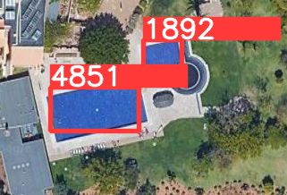
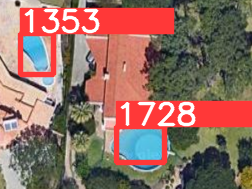
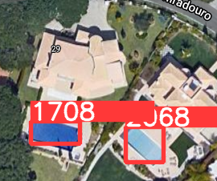

# Swimming-Pool-Detection

Swimming pool detection is a commonly performed task in computer vision. Here, we have used transfer learning to train YOLOv5 architecture on this [dataset](https://www.kaggle.com/datasets/cici118/swimming-pool-detection-algarves-landscape). You can see some sample results below

  

## How to run?

 - Clone the repository
 ```
 git clone https://github.com/phoenixrider12/Swimming-Pool-Detection.git
 ```
  - Place the testing images in the folder `swimming_pools`
  - Run the `run.sh` file in terminal.
#### Your results will be saved in folder `runs/detect/exp2`.
The value written over image is the area of swimming pool as detected by the model.
<br>
<h3 align="left"> Made and maintained by : </h3>

<table>
	<td align="center">
     <a href="https://github.com/phoenixrider12">
    <br /><sub><b>Aryaman Gupta</b></sub></a><br />
	</td>
 <td align="center">
     <a href="https://github.com/Ankur-Agrawal-ece20">
    <br /><sub><b>Ankur Agrawal</b></sub></a><br />
    </td>
<td align="center">
     <a href="https://github.com/vivekagarwal2349">
    <br /><sub><b>Vivek Agarwal</b></sub></a><br />
	</td>
</table>
